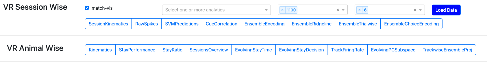

# analysisVR

Analysis and visualization tools for virtual-reality behavior and electrophysiology experiments in rodents.

## Start the GUI

From the repository root:

```bash
python3 main_analysis.py
```

The app starts on `http://localhost:8050` (or `http://0.0.0.0:8050`).

Optional log level:

```bash
python3 main_analysis.py DEBUG
```

## Installation

```bash
python3 -m venv .venv
source .venv/bin/activate
pip install -r requirements.txt
```

Note: `main_analysis.py` imports `baseVR.base_functionality` from the parent directory, so ensure the sibling `baseVR` package is available.
Note: You might have to change data source paths depending on the machine you are running this repo on (Debug Logging will tell you where).

## Analytics Included in the GUI (Plots + Wrappers)


### Session-wise plots

- `SessionKinematics` (`wrapper_SessionKinematics.py`): Single-session track-aligned behavior traces/heatmaps (velocity, acceleration, lick, ball/yaw/pitch metrics), with optional event overlays.
- `RawSpikes` (`wrapper_RawSpikes.py`): Raw electrophysiology traces with spike overlays for selected shanks, channel groups, and time windows.
- `SVMPredictions` (`wrapper_SVMPredictions.py`): SVM decoding performance across sessions for cue/outcome/choice predictors (accuracy or macro-F1).
- `CueCorrelation` (`wrapper_CueCorrelation.py`): Population-vector cue correlation (Cue1 vs Cue2) along track position.
- `EnsembleEncoding` (`wrapper_EnsembleEncoding.py`): Ensemble activation trajectories aligned to events/intervals, summarized across sessions.
- `EnsembleSessionwise` (`wrapper_EnsembleSessionwise.py`): Ridgeline-style view of ensemble activity distributions over intervals/events.
- `EnsembleTrialwise` (`wrapper_EnsembleTrialwise.py`): Trial-resolved ensemble dynamics with interval-local temporal structure.
- `EnsembleChoiceEncoding` (`wrapper_EnsembleChoiceEncoding.py`): Event-aligned ensemble activity focused on trial choice structure.

### Animal-wise plots

- `Kinematics` (`wrapper_AnimalKinematics.py`): Multi-session kinematic summaries per animal across the track.
- `StayPerformance` (`wrapper_StayPerformance.py`): Session-by-session success/failure and stay-time performance trends.
- `StayRatio` (`wrapper_StayRatio.py`): Trial-level reward-zone stay-time distributions and ratio behavior.
- `SessionsOverview` (`wrapper_SessionsOverview.py`): Metadata/analytics availability overview across dates and sessions.
- `EvolvingStayTime` (`wrapper_EvolvingStayTime.py`): Evolution of R1/R2 stay times across trials and sessions.
- `EvolvingStayDecision` (`wrapper_EvolvingStayDecision.py`): Evolution of stay/skip strategy patterns over training.
- `TrackFiringRate` (`wrapper_TrackFiringRate.py`): Track-position tuning of firing rates across sessions.
- `EvolvingPCSubspace` (`wrapper_EvolvingPCSubspace.py`): Cross-session principal-component and canonical-angle subspace drift.
- `TrackwiseEnsembleProj` (`wrapper_TrackwiseEnsembleProj.py`): Trackwise ensemble projection dynamics across sessions.

## Data Split Parameters (Behavior / Cue / Outcome)

Most behavior-driven wrappers use shared filtering/grouping controls from
`dashsrc/plot_components/plot_wrappers/data_selection.py`.

- Outcome split:
  - `1 R`: Stoping only in correct reward zone
  - `1+ R`: Stop in both reward zones
  - `no R`: non-rewarded outcomes
- Cue split:
  - `Cue1 trials`
  - `Cue2 trials`
- Behavior split:
  - `R1 choice`: `stop` vs `skip`
  - `R2 choice`: `stop` vs `skip`
- Session-progress split:
  - `1/3`, `2/3`, `3/3` (first/middle/last third of trials)

Where supported, data can be split/grouped by:
- `Outcome`
- `Cue`
- `Part of session`
- `R1 choice`
- `R2 choice`
- `None` (no grouping)
